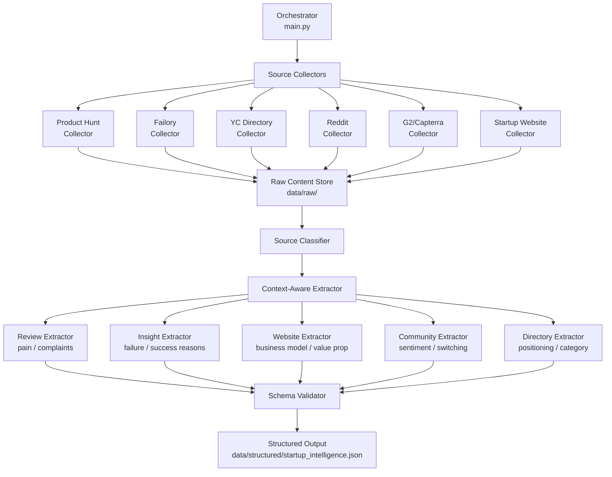

# MIDAN — Startup Intelligence Data Acquisition System

## Goal

Build a **structured web intelligence pipeline** that scrapes, classifies, and extracts startup-level signals from multiple public data sources — converting raw web content into clean, schema-compliant JSON entries that power the MIDAN reasoning engine (L2/L3/L4).

---

## Background

The current MIDAN system suffers from:
- Over-reliance on macroeconomic data (GDP, inflation)
- Generic, repetitive signal patterns
- Inability to differentiate business models (e.g., SaaS vs. fintech)

This pipeline solves the problem by harvesting **real-world startup knowledge** — pain points, failure/success patterns, business models, user sentiment — from diverse sources and structuring it into a unified schema.

---

## User Review Required

> [!IMPORTANT]
> **API Keys Required**: The pipeline uses Reddit (PRAW) and optionally Product Hunt's GraphQL API. You will need to provide API credentials before running those collectors. Do you already have these?

> [!WARNING]
> **G2 / Capterra Scraping**: These platforms use aggressive anti-bot protection (DataDome WAF). Direct scraping is unreliable and may violate their ToS. The plan uses a **browser-based approach with Playwright** and rate-limiting, but success is not guaranteed. An alternative approach using **pre-existing review datasets** or **LLM-synthesized review patterns** is proposed as a fallback. Which approach do you prefer?

> [!IMPORTANT]
> **CB Insights**: This is a paid, subscription-gated platform. Scraping it is legally risky and technically infeasible without credentials. The plan **excludes CB Insights** and focuses on freely accessible sources (Failory, YC directory, public blogs). Is this acceptable?

> [!IMPORTANT]
> **LLM for Extraction**: For unstructured narrative content (Failory case studies, Reddit threads), the pipeline uses an LLM (OpenAI GPT-4o or similar) to perform structured extraction from raw text. Do you have an OpenAI API key, or do you want to use a local model (e.g., Ollama)?

---

## Architecture Overview



---

## Proposed Changes

### Project Structure

```
c:\Users\seif alaa\PROJECT_SCRAPPED_DATA\
├── config/
│   └── settings.py              # API keys, rate limits, target URLs
├── collectors/
│   ├── __init__.py
│   ├── base_collector.py        # Abstract base class for all collectors
│   ├── producthunt_collector.py # Product Hunt GraphQL API collector
│   ├── failory_collector.py     # Failory startup failure case studies
│   ├── yc_collector.py          # Y Combinator directory scraper
│   ├── reddit_collector.py      # Reddit PRAW-based community scraper
│   ├── review_collector.py      # G2/Capterra review scraper (Playwright)
│   └── website_collector.py     # Generic startup website scraper
├── extractors/
│   ├── __init__.py
│   ├── base_extractor.py        # Abstract base class for extractors
│   ├── review_extractor.py      # Pain points, complaints, usability
│   ├── insight_extractor.py     # Failure/success reasons, growth challenges
│   ├── website_extractor.py     # Business model, value prop, target user
│   ├── community_extractor.py   # Sentiment, switching behavior, complaints
│   └── directory_extractor.py   # Positioning, category, messaging
├── processors/
│   ├── __init__.py
│   ├── source_classifier.py     # Classifies raw content by source type
│   ├── schema_validator.py      # Validates output against target schema
│   └── deduplicator.py          # Deduplicates entries by startup name
├── llm/
│   ├── __init__.py
│   └── extraction_engine.py     # LLM-powered structured extraction
├── data/
│   ├── raw/                     # Raw scraped content (intermediate)
│   ├── structured/              # Final structured JSON output
│   └── logs/                    # Scraping logs and error reports
├── utils/
│   ├── __init__.py
│   ├── http_client.py           # Rate-limited HTTP client with retries
│   ├── text_cleaner.py          # HTML cleaning, text normalization
│   └── logger.py                # Structured logging
├── targets/
│   └── startup_targets.json     # List of startup names/URLs to scrape
├── main.py                      # Pipeline orchestrator
├── requirements.txt             # Python dependencies
├── .env.example                 # Template for API keys
└── README.md                    # Project documentation
```

---

### Component Details

---

#### Config Layer

##### [NEW] [settings.py](file:///c:/Users/seif alaa/PROJECT_SCRAPPED_DATA/config/settings.py)
- Centralized configuration: API keys (loaded from `.env`), rate limits, timeouts
- Source-specific settings (max pages, delay intervals)
- Target schema definition as a Python dataclass
- Output paths

---

#### Collectors (Data Fetching Layer)

##### [NEW] [base_collector.py](file:///c:/Users/seif alaa/PROJECT_SCRAPPED_DATA/collectors/base_collector.py)
- Abstract base class with `collect()` method
- Built-in rate limiting, retry logic, and error handling
- Saves raw content to `data/raw/{source_type}/{startup_name}.json`

##### [NEW] [producthunt_collector.py](file:///c:/Users/seif alaa/PROJECT_SCRAPPED_DATA/collectors/producthunt_collector.py)
- Uses Product Hunt GraphQL API v2
- Fetches: product name, tagline, description, topics, votes, website URL
- Handles pagination and rate limits (6,250 complexity points / 15 min)
- **Fallback**: If no API key, uses `requests` + BeautifulSoup on public product pages

##### [NEW] [failory_collector.py](file:///c:/Users/seif alaa/PROJECT_SCRAPPED_DATA/collectors/failory_collector.py)
- Crawls Failory's startup failure/success case study index pages
- Collects individual article URLs from category pages
- Fetches full article content (narrative text)
- Uses BeautifulSoup for HTML parsing

##### [NEW] [yc_collector.py](file:///c:/Users/seif alaa/PROJECT_SCRAPPED_DATA/collectors/yc_collector.py)
- Leverages YC's public Algolia search API (`yc-oss/api` pattern)
- Fetches: company name, description, batch, industry, status, team size
- No authentication required — publicly accessible index

##### [NEW] [reddit_collector.py](file:///c:/Users/seif alaa/PROJECT_SCRAPPED_DATA/collectors/reddit_collector.py)
- Uses PRAW (Python Reddit API Wrapper)
- Targets subreddits: `r/startups`, `r/SaaS`, `r/Entrepreneur`, `r/smallbusiness`, `r/venturecapital`
- Searches for startup-specific threads (by name or domain)
- Extracts: post title, body, top comments, sentiment indicators

##### [NEW] [review_collector.py](file:///c:/Users/seif alaa/PROJECT_SCRAPPED_DATA/collectors/review_collector.py)
- Uses Playwright for JavaScript-rendered review pages
- Targets G2 and Capterra product review pages
- Extracts: rating, pros, cons, reviewer role, use case
- Implements aggressive rate limiting (5-10s between requests)
- **Fallback**: Pre-curated review dataset or skip if blocked

##### [NEW] [website_collector.py](file:///c:/Users/seif alaa/PROJECT_SCRAPPED_DATA/collectors/website_collector.py)
- Generic scraper for individual startup websites
- Fetches homepage, about page, pricing page
- Uses `requests` + BeautifulSoup
- Extracts visible text content, meta tags, structured data (JSON-LD)

---

#### Extractors (Intelligence Extraction Layer)

Each extractor applies **source-specific logic** to convert raw content into structured fields.

##### [NEW] [review_extractor.py](file:///c:/Users/seif alaa/PROJECT_SCRAPPED_DATA/extractors/review_extractor.py)
- **Input**: Raw review text (G2, Capterra)
- **Output fields**: `pain_points`, `user_complaints`, `adoption_barriers`
- Uses LLM extraction with targeted prompts for complaint/praise classification

##### [NEW] [insight_extractor.py](file:///c:/Users/seif alaa/PROJECT_SCRAPPED_DATA/extractors/insight_extractor.py)
- **Input**: Failory case studies, YC blog posts
- **Output fields**: `failure_reasons`, `success_drivers`, `differentiation`, `competition_density`
- LLM-powered extraction of causal narratives

##### [NEW] [website_extractor.py](file:///c:/Users/seif alaa/PROJECT_SCRAPPED_DATA/extractors/website_extractor.py)
- **Input**: Startup website content
- **Output fields**: `business_model`, `target_user`, `value_proposition`, `industry`
- Combines meta tag analysis + LLM interpretation of page content

##### [NEW] [community_extractor.py](file:///c:/Users/seif alaa/PROJECT_SCRAPPED_DATA/extractors/community_extractor.py)
- **Input**: Reddit posts and comments
- **Output fields**: `pain_points`, `user_complaints`, `switching_cost`
- Sentiment analysis + complaint extraction via LLM

##### [NEW] [directory_extractor.py](file:///c:/Users/seif alaa/PROJECT_SCRAPPED_DATA/extractors/directory_extractor.py)
- **Input**: Product Hunt product data
- **Output fields**: `value_proposition`, `industry`, `differentiation`
- Structured field mapping + LLM enhancement

---

#### Processors (Data Quality Layer)

##### [NEW] [source_classifier.py](file:///c:/Users/seif alaa/PROJECT_SCRAPPED_DATA/processors/source_classifier.py)
- Classifies incoming raw content by source type: `review`, `insight`, `website`, `community`, `directory`
- Routes to appropriate extractor

##### [NEW] [schema_validator.py](file:///c:/Users/seif alaa/PROJECT_SCRAPPED_DATA/processors/schema_validator.py)
- Validates each output entry against the target JSON schema
- Enforces: no empty `startup_name`, valid `source_type`, no macro indicators
- Strips hallucinated/fabricated data (checks for generic filler patterns)

##### [NEW] [deduplicator.py](file:///c:/Users/seif alaa/PROJECT_SCRAPPED_DATA/processors/deduplicator.py)
- Merges entries with the same `startup_name` from different sources
- Combines fields (e.g., pain points from reviews + community)
- Resolves conflicts (e.g., different business model labels)

---

#### LLM Integration

##### [NEW] [extraction_engine.py](file:///c:/Users/seif alaa/PROJECT_SCRAPPED_DATA/llm/extraction_engine.py)
- Unified LLM interface for all extractors
- Source-type-specific prompt templates
- Enforces JSON output format with field validation
- Supports OpenAI API (GPT-4o) and local models (Ollama) via adapter pattern
- Handles token limits, chunking for long documents

---

#### Pipeline Orchestrator

##### [NEW] [main.py](file:///c:/Users/seif alaa/PROJECT_SCRAPPED_DATA/main.py)
- CLI-driven pipeline: `python main.py --sources all --targets startup_targets.json`
- Pipeline steps:
  1. Load target startup list
  2. Run collectors (parallel with asyncio)
  3. Classify raw content
  4. Apply source-specific extractors
  5. Validate against schema
  6. Deduplicate and merge
  7. Output to `data/structured/startup_intelligence.json`
- Progress tracking and error reporting

---

### Target Schema (Output)

Every entry in the final dataset conforms to:

```json
{
  "startup_name": "string (required)",
  "industry": "string",
  "business_model": "string",
  "target_user": "string",
  "value_proposition": "string",

  "pain_points": ["string"],
  "adoption_barriers": ["string"],
  "user_complaints": ["string"],

  "success_drivers": ["string"],
  "failure_reasons": ["string"],

  "differentiation": "string",
  "switching_cost": "string",
  "competition_density": "string",

  "source_type": "string (review|insight|website|community|directory)",
  "source_url": "string"
}
```

---

### Dependencies

| Package | Purpose |
| :--- | :--- |
| `requests` | HTTP client for API calls and basic scraping |
| `beautifulsoup4` | HTML parsing |
| `lxml` | Fast HTML/XML parser |
| `playwright` | Browser automation for JS-heavy sites (G2, Capterra) |
| `praw` | Reddit API wrapper |
| `openai` | LLM-powered structured extraction |
| `python-dotenv` | Environment variable management |
| `pydantic` | Schema validation and data modeling |
| `asyncio` / `aiohttp` | Async HTTP for parallel collection |
| `tenacity` | Retry logic with exponential backoff |
| `rich` | CLI progress bars and logging |

---

## Open Questions

> [!IMPORTANT]
> 1. **API Keys**: Do you have API keys for Reddit (PRAW) and OpenAI? If not, which LLM provider should we target?

> [!IMPORTANT]
> 2. **Target Startups**: Do you have a specific list of startups to target, or should the system discover startups dynamically from Product Hunt / YC?

> [!WARNING]
> 3. **G2/Capterra Strategy**: Given their anti-bot protection, should we:
>    - (A) Attempt Playwright scraping with rate limiting (may fail)
>    - (B) Use a curated fallback dataset
>    - (C) Skip review platforms entirely and rely on Reddit for user sentiment

> [!IMPORTANT]
> 4. **Scale**: How many startups should the initial dataset target? (e.g., top 50, top 200, top 500?)

> [!IMPORTANT]
> 5. **Integration**: How will this dataset integrate with the existing MIDAN L2/L3/L4 pipeline? Is it loaded as a static JSON file, or should we expose it via an API?

---

## Verification Plan

### Automated Tests

1. **Unit tests** for each collector: verify raw content structure
2. **Schema validation tests**: run `schema_validator.py` against all output entries
3. **Integration test**: end-to-end pipeline run with 3-5 target startups
4. **Data quality checks**:
   - No entries with empty `startup_name`
   - No macro indicators (GDP, inflation) in any field
   - All `source_type` values are valid enum values
   - No duplicate entries after deduplication

### Manual Verification

1. Spot-check 10 random entries against their source URLs
2. Verify that different source types produce different field distributions
3. Confirm the final JSON is loadable by the MIDAN engine
4. Test with 3 diverse startups (SaaS, fintech, marketplace) to verify differentiation
