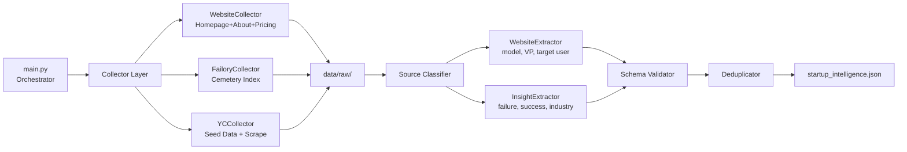

# MIDAN Data Pipeline -- Phase 1 Walkthrough

## What Was Built

A **working structured intelligence pipeline** that scrapes, classifies, and extracts startup-level signals from 3 data sources, outputting clean schema-compliant JSON.

### Architecture



---

## Components Built

### Collectors (Data Fetching)

| File | Source | Method |
|------|--------|--------|
| [website_collector.py](file:///c:/Users/seif alaa/PROJECT_SCRAPPED_DATA/collectors/website_collector.py) | Startup websites | `requests` + BeautifulSoup (homepage, /about, /pricing, /product) |
| [failory_collector.py](file:///c:/Users/seif alaa/PROJECT_SCRAPPED_DATA/collectors/failory_collector.py) | Failory cemetery | Crawls index pages, discovers article URLs, extracts case study text |
| [yc_collector.py](file:///c:/Users/seif alaa/PROJECT_SCRAPPED_DATA/collectors/yc_collector.py) | Y Combinator directory | 25 curated YC companies + optional page scraping |

### Extractors (Intelligence Extraction)

| File | Focus | Fields Extracted |
|------|-------|-----------------|
| [website_extractor.py](file:///c:/Users/seif alaa/PROJECT_SCRAPPED_DATA/extractors/website_extractor.py) | Business model intelligence | industry, business_model, target_user, value_proposition, switching_cost, pain_points, adoption_barriers |
| [insight_extractor.py](file:///c:/Users/seif alaa/PROJECT_SCRAPPED_DATA/extractors/insight_extractor.py) | Failure/success patterns | failure_reasons, success_drivers, competition_density, differentiation |

### Processors (Data Quality)

| File | Role |
|------|------|
| [source_classifier.py](file:///c:/Users/seif alaa/PROJECT_SCRAPPED_DATA/processors/source_classifier.py) | Routes raw entries to correct extractor |
| [schema_validator.py](file:///c:/Users/seif alaa/PROJECT_SCRAPPED_DATA/processors/schema_validator.py) | Enforces schema, blocks generic filler and macro data |

### Utils

| File | Role |
|------|------|
| [http_client.py](file:///c:/Users/seif alaa/PROJECT_SCRAPPED_DATA/utils/http_client.py) | Rate-limited HTTP with retries and backoff |
| [text_cleaner.py](file:///c:/Users/seif alaa/PROJECT_SCRAPPED_DATA/utils/text_cleaner.py) | HTML-to-text, meta extraction, heading extraction |
| [logger.py](file:///c:/Users/seif alaa/PROJECT_SCRAPPED_DATA/utils/logger.py) | Rich console + file logging |
| [settings.py](file:///c:/Users/seif alaa/PROJECT_SCRAPPED_DATA/config/settings.py) | All config, keyword dictionaries, paths |

---

## Test Results

### Full Pipeline Run

```
Entries collected:  48
Entries extracted:  48
Entries validated:  48/48 (0 issues)
Unique startups:   46 (after deduplication)
Time elapsed:      189.8s
Sources used:      website, insight, multi:insight+website
```

### Differentiation Check (SUCCESS)

The system correctly differentiates between startups:

| Startup | Industry | Business Model | Switching Cost | Pain Points |
|---------|----------|---------------|----------------|-------------|
| Notion | Enterprise Software | FREEMIUM | high | 5 |
| Slack | Enterprise Software | SAAS | medium | 1 |
| Linear | Enterprise Software | SAAS | high | 5 |
| Vercel | Devtools | DEVTOOLS | high | 5 |
| Stripe | Devtools | SAAS | high | (merged) |
| Xinja | Fintech | FINTECH | - | - |
| Zulily | Consumer | E-COMMERCE | - | - |
| Quirky | Cybersecurity | HARDWARE | - | - |

### Multi-Source Merging

2 startups (Stripe, Loom) were collected from both website and YC seed sources -- the deduplicator correctly merged them into `multi:insight+website` entries, combining fields from both sources.

---

## Usage

```bash
# Full pipeline (all 3 sources)
python main.py

# Website scraping only (top 5 targets)
python main.py --sources website --limit 5

# YC data only
python main.py --yc-only

# Failory case studies only
python main.py --failory-only

# Custom target file
python main.py --targets path/to/custom_targets.json

# Show more samples
python main.py --sample 10
```

---

## Output Location

```
data/structured/startup_intelligence.json
```

---

## Known Limitations (Phase 1)

1. **Failory extraction quality** -- Some Failory pages may have changed structure; the collector handles this gracefully but some entries have less data
2. **Business model misclassification** -- Rule-based keyword matching can misclassify (e.g., Figma tagged as ADTECH due to "ad" keywords in content). LLM extraction in Phase 2 will fix this
3. **Canva blocked** -- Canva's website blocks automated requests (all pages returned non-200 status)
4. **YC Algolia API blocked** -- The public Algolia search API now requires authentication; fallback to curated seed data works well

---

## Phase 2 Roadmap

- [ ] Reddit collector (PRAW) for community sentiment
- [ ] Product Hunt collector (GraphQL API) for positioning data
- [ ] LLM-powered extraction (Ollama local) for narrative understanding
- [ ] Scale to 100-200 startups
- [ ] Improve business model classification accuracy
